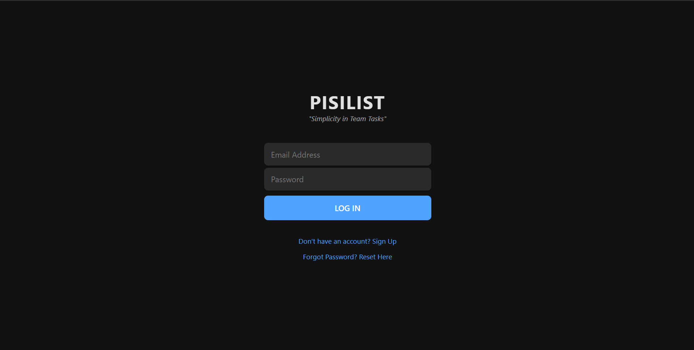
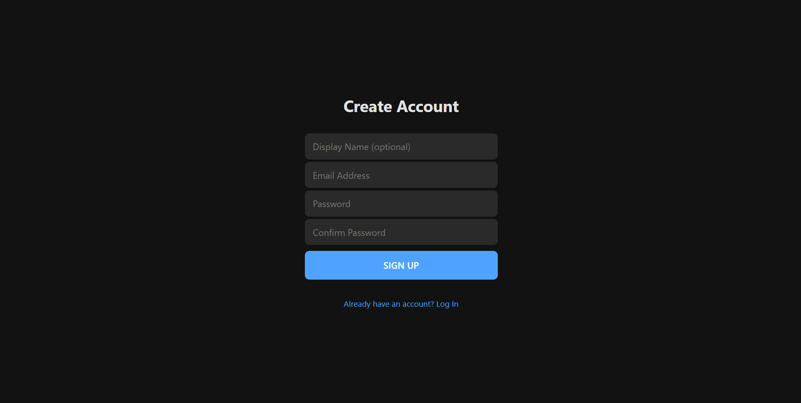
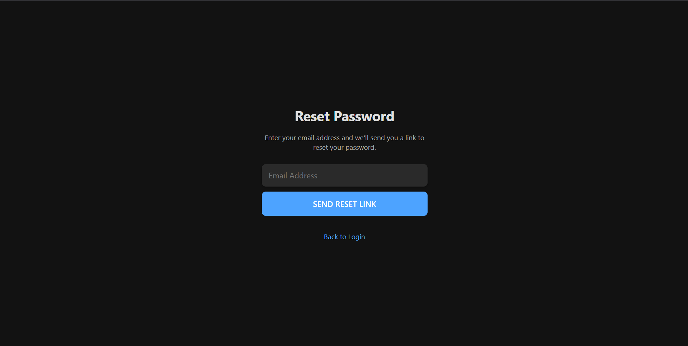
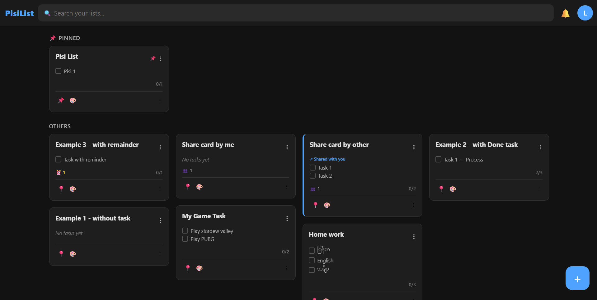
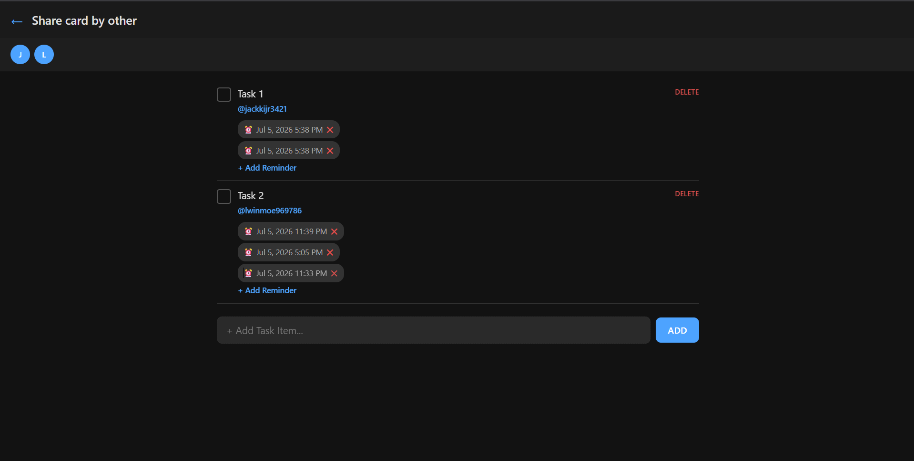
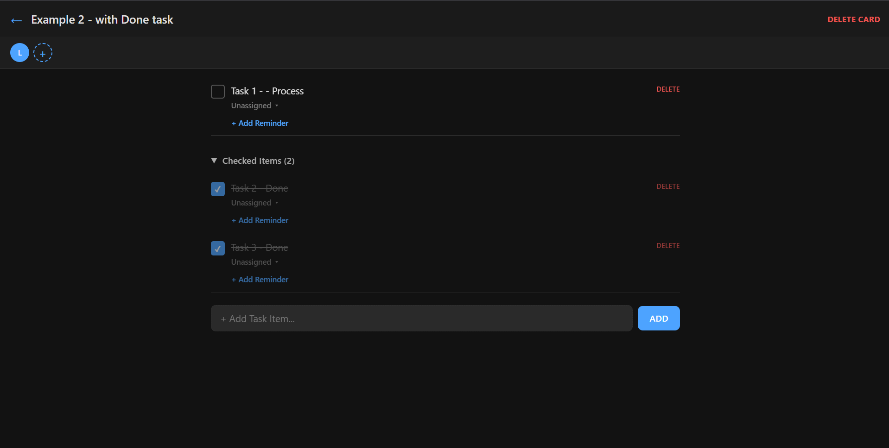
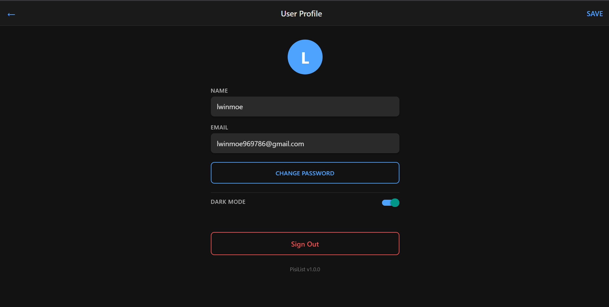

# PisiList

**A minimal Google Keep-inspired collaborative task management app built with React Native, Expo, and Firebase.**

## Live Demo

Live Demo: **[https://pisilist-app.web.app](https://pisilist-app.web.app)**

---

> **Chapter 3 Assignment — Vibe Code Tours AI-Driven Software Development Bootcamp**
> [vibecode.tours](https://vibecode.tours/) | Lead by [Ko Ko Yee](https://github.com/kokoye2007)

This project is the Chapter 3 Assignment for the Vibe Code Tours bootcamp, focusing on hands-on practical implementation of automated **Model Context Protocol (MCP)** environments, modular **AI Skills**, dedicated **Agents** and **Sub-agents**, and **LLM Wiki document systems**. It demonstrates the workflow methodology of precise AI prompt composition to achieve exact development architecture output — from initial specification through production deployment, entirely driven by structured AI collaboration.

---

## Project Description

PisiList was born from a real-world need: My girlfriend works in a fast-paced environment where she needs to quickly assign tasks to coworkers and set **multiple granular push notification reminders** per item (2–3 distinct alerts per day per task). Existing tools like Trello, Todoist, or basic checklist apps either lack multi-reminder support, overwhelm users with feature bloat, or impose artificial constraints on reminder scheduling.

PisiList solves this with a **clean, clutter-free mobile interface** that focuses on three core actions:

1. **Create cards** — group related tasks under a single list
2. **Assign & collaborate** — invite coworkers by email, assign specific tasks to specific people
3. **Multi-remind** — set multiple time-based reminders per task with native push notifications

The result is a lightweight, purpose-built tool that does exactly what's needed — nothing more, nothing less.

---

## Screenshots

## 01. Login page



## 02. Singup Page



## 03. Reset Password Page



## 04. Home page - Card Preview (masonry grid)



## 05. Card Detail Page - Collaborator and Reminder Management



## 06. Card Detail Page - Done tasks



## 07. Profile Page - User Settings



## MVP Features

| Feature               | Description                                                                           |
| --------------------- | ------------------------------------------------------------------------------------- |
| Email/Password Auth   | Sign-up, login, password reset via Firebase Auth                                      |
| Card & Task CRUD      | Create cards, add/toggle/delete tasks with real-time sync                             |
| Collaborative Lists   | Invite by email, accept/decline, shared cards on dashboard                            |
| Per-Task Assignment   | Assign tasks to specific collaborators with inline picker                             |
| Multi-Reminder System | Multiple reminders per task — native push on Android/iOS, browser Notification on web |
| Masonry Dashboard     | Responsive staggered grid (1–4 columns) with pin/unpin and color accents              |
| Dark Mode             | System-aware theme with manual toggle, 18 color tokens                                |
| Cross-Platform        | Web (browser), Android (Expo Go / dev build), iOS (dev build)                         |

---

## Upcoming Features

- Profile picture upload and username editing
- Password change for logged-in users
- Email verification on sign-up
- User roles and permission levels (owner vs. collaborator)
- Card sharing via link or QR code
- Offline support with Firestore persistence
- Drag-and-drop task reorder
- Card archiving and data export (JSON/CSV)
- App store deployment (Google Play + Apple App Store)

---

## AI Framework Configurations (MCP, Skills, Agents)

| Component       | Purpose                                                                                                  |
| --------------- | -------------------------------------------------------------------------------------------------------- |
| **MCP Servers** | Firebase (Firestore, Auth, Hosting), GitHub (commits, PRs), Context7 (library docs)                      |
| **Agents**      | `git_manager` (commits/PRs), `wiki_manager` (documentation), `test_manager` (Jest/coverage)              |
| **Skills**      | `code_review` (API validation via Context7), `documentation` (API reference generation)                  |
| **Wiki System** | `wiki/report.md` (session log), `wiki/state.md` (project state), `wiki/code_flowchart.md` (architecture) |

---

## Getting Started

### Prerequisites

- **Node.js** 18+ (recommended: 20+)
- **npm** or **bun** package manager
- **Expo CLI** (`npm install -g expo-cli`)
- **Firebase CLI** (`npm install -g firebase-tools`) — for deployment
- **Expo Go** app on your Android/iOS device (optional, for mobile testing)

### 1. Clone the Repository

```bash
git clone https://github.com/lwinmoe51/pisilist.git
cd pisilist
```

### 2. Install Dependencies

```bash
npm install
# or
bun install
```

### 3. Environment Setup

The Firebase configuration is already included in `src/config/firebase.ts`. No `.env` file is required for local development — the app connects directly to the `pisilist-app` Firebase project.

If you want to use your own Firebase project, update the config in:

```
src/config/firebase.ts
```

### 4. Start the Development Server

```bash
# Web (browser)
npm run web

# Web (WSL2 → Windows browser)
npm run web:wsl

# Android (Expo Go)
npm run android

# iOS (Expo Go)
npm run ios

# All platforms
npx expo start
```

### 5. Run Tests

```bash
npm test                  # Run all 133 tests
npm run test:coverage     # Run with coverage report
npx tsc --noEmit          # TypeScript type-check
```

### 6. Deploy (optional)

```bash
# Build web export
npx expo export --platform web

# Deploy to Firebase Hosting
firebase deploy --only hosting --project pisilist-app

# Deploy Firestore rules
firebase deploy --only firestore:rules --project pisilist-app
```

---

## Tech Stack

| Layer         | Technology                                                   |
| ------------- | ------------------------------------------------------------ |
| Frontend      | React Native 0.85.3 + React 19.2 + Expo SDK 56               |
| Web Support   | react-native-web 0.21 + react-dom 19.2                       |
| Backend       | Firebase 11 (Firestore + Auth + Hosting)                     |
| Navigation    | React Navigation 7 (native-stack)                            |
| State         | React Context + Firestore real-time listeners                |
| Notifications | Expo Notifications (native) / Browser Notification API (web) |
| Storage       | @react-native-async-storage/async-storage (theme persistence)|
| UI Components | @react-native-community/datetimepicker 9.1                    |
| PWA           | Service Worker + Web Manifest (inject-pwa-meta.js)           |
| Testing       | Jest 29 + @testing-library/react-native 14                   |
| Language      | TypeScript 6                                                 |


| Layer         | Technology                                                   |
| ------------- | ------------------------------------------------------------ |
| Frontend      | React Native 0.85.3 + Expo SDK 56                            |
| Backend       | Firebase (Firestore + Auth + Hosting)                        |
| Navigation    | React Navigation 7 (native stack)                            |
| State         | React Context + Firestore real-time listeners                |
| Notifications | Expo Notifications (native) / Browser Notification API (web) |
| Testing       | Jest 29 + @testing-library/react-native 14                   |
| Language      | TypeScript 6                                                 |

---

## Project Structure

```
pisilist/
├── src/
│   ├── config/         # Firebase initialization
│   ├── services/       # Firestore CRUD (auth, cards, users, invitations, notifications)
│   ├── contexts/       # React Context providers (Auth, Cards, Invitations)
│   ├── components/     # Reusable UI (CardPreview, Toast, ConfirmModal, etc.)
│   ├── screens/        # App screens (Dashboard, CardDetail, Invitations, Settings, Auth)
│   ├── navigation/     # React Navigation config
│   ├── theme/          # Color tokens + ThemeContext
│   ├── types/          # TypeScript interfaces
│   └── __tests__/      # 133 tests across 9 suites
├── wiki/               # AI-generated documentation (report, state, flowchart)
├── firestore.rules     # Firebase Security Rules
└── firebase.json       # Firebase project config
```

---

## License

MIT

## Acknowledgments

Built as part of the [Vibe Code Tours](https://vibecode.tours/) AI-driven software development bootcamp — Chapter 3 Assignment, mentor by [Ko Ko Yee](https://github.com/kokoye2007).
